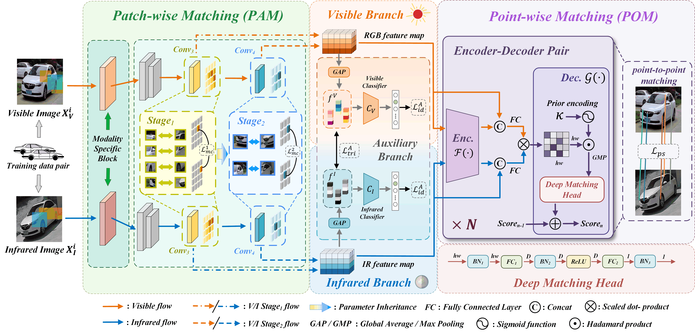

<div align="center">
  <h1><b>PORSCHE: Progressive Optimization and Robust Spatial Convolution for Hybrid Enhancement in Visible-Infrared Vehicle Re-Identification </b></h1>
</div>

<div align="center">
  <a href="https://github.com/HowardLiu28">Yinhao Liu</a><sup>1</sup>, <a href="https://github.com/KZYYYY">Zhenyu Kuang</a><sup>2*</sup>, <a href="https://github.com/HRT00">Hongyang Zhang</a><sup>1</sup>, Yige Ma<sup>1</sup>, Xinghao Ding<sup>1*</sup>, Yue Huang<sup>1</sup>, Congbo Cai<sup>3</sup>, Xiaosong Li<sup>4</sup>
</div>

<div align="center">
  <sup>1</sup> School of Informatics, Xiamen University         <sup>2</sup> School of Electronic and Information Engineering, Foshan University     <sup>3</sup> Department of Electronic Science, Xiamen University      <sup>4</sup> School of Physics and Optoelectronic Engineering, Foshan University
</div>

---
>
> 🙋 Please let us know if you find out a mistake or have any suggestions!
> 
> 🙏 If you find this resource helpful, please consider to star this repository and cite our research:

```
@article{liu2025porsche,
  title={PORSCHE: Progressive Optimization and Robust Spatial Convolution for Hybrid Enhancement in Visible-Infrared Vehicle Re-Identification},
  author={Liu, Yinhao and Kuang, Zhenyu and Zhang, Hongyang and Ma, Yige and Ding, Xinghao and Huang, Yue and Cai, Congbo and Li, Xiaosong},
  journal={IEEE Internet of Things Journal},
  year={2025},
  publisher={IEEE}
}
```

## 🏆 Updates/News:

🚩 **News** (June.11 2025): PORSCHE has been accpeted by IEEE Internet of Things Journal, 2025.

🚩 **News** (August.28 2025): The paper is availble at <a href="https://ieeexplore.ieee.org/abstract/document/11030758">here</a>.

🚩 **News** (September.9 2025): The code is now released.

## 📰 Introduction:

PORSCHE is a framework for visible-infrared vehicle re-identification tasks. Its core concept lies in designing two matching modules—PAM and POM—at different granularities, and optimizing the overall architecture through an incremental strategy.
<p align="center">

</p>

## 🤗 Basic Preparation:

You can download the corresponding datasets via the links (<a href="https://pan.baidu.com/s/167TY9fCz5ZjtDdsOIovX1w?pwd=msvr">MSVR310</a>[Code: msvr], <a href="https://drive.google.com/file/d/186Ep0YgHY0a8BQ1Z59HP1D2-kZazbH02/view?usp=drive_link">WMVeID863</a>, <a href="https://pan.baidu.com/s/1uiKcqiqdhd13nLSW8TUASg">RGBN300</a>[Code: 11y8]) and extract them into the `./datasets` folder.

## 🛠️ Requirements and Installation:

Ensure your environment meets the following requirements under python 3.11.11:

- einops==0.8.1
- matplotlib==3.10.6
- numpy==2.3.2
- opencv_python==4.11.0.86
- Pillow==11.3.0
- scikit_learn==1.7.1
- seaborn==0.13.2
- thop==0.1.1
- torch==2.1.0
- torchcontrib==0.0.2
- torchvision==0.16.0
- wandb==0.21.3
- yacs==0.1.8


For convenience, you can run:
```bash
conda create -n porsche python=3.11.11 -y
conda activate porsche
pip install -r requirements.txt
```

## 🚀 Getting Started:

The configuration file corresponding to the proposed PORSCHE method is `./configs/porsche.yml`. You can directly run the following command to train and evaluate the model:
```bash
python main.py --config_file "./configs/porsche.yml"
```

## 🌟 Acknowledgement:
Our implementation adapts [reid-strong-baseline](https://github.com/michuanhaohao/reid-strong-baseline/tree/master), and [CCNet](https://github.com/superlollipop123/Cross-directional-Center-Network-and-MSVR310) as the code base and have extensively modified it to our purposes. We thank the authors for sharing their implementations and related resources.

```
@inproceedings{luo2019bag,
  title={Bag of tricks and a strong baseline for deep person re-identification},
  author={Luo, Hao and Gu, Youzhi and Liao, Xingyu and Lai, Shenqi and Jiang, Wei},
  booktitle={Proceedings of the IEEE/CVF conference on computer vision and pattern recognition workshops},
  pages={0--0},
  year={2019}
}
```
```
@article{zheng2022multi,
  title={Multi-spectral vehicle re-identification with cross-directional consistency network and a high-quality benchmark},
  author={Zheng, Aihua and Zhu, Xianpeng and Ma, Zhiqi and Li, Chenglong and Tang, Jin and Ma, Jixin},
  journal={arXiv preprint arXiv:2208.00632},
  year={2022}
}
```
